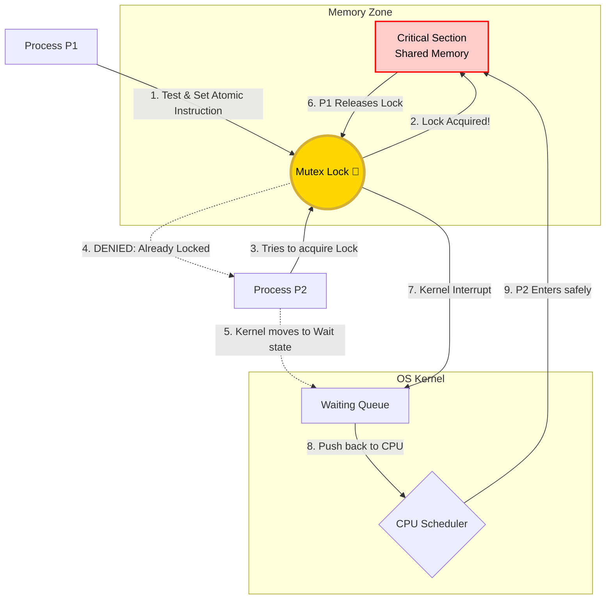

# OS Visual Lab: Process Synchronization

## 1. CONCEPT INTRODUCTION

**Process Synchronization** is the traffic control system of an operating system. When multiple processes or threads share resources—like memory variables, files, or hardware devices—they can accidentally overwrite each other's work if they try to access the resource at the exact same time. This chaos is called a **Race Condition**.

To prevent this, the OS uses synchronization techniques. By creating a restricted zone called the **Critical Section**, the OS ensures that only one process can enter and modify shared data at a time. The others must wait until the resource is safe to access.

---

## 2. VISUAL ANIMATION SECTION (1️⃣ Visual Mode)

**Animation Title: The Shared Bank Account Disaster & Fix**

* **The Race Condition (Without Sync):**
  * **Visual:** Two processes, P1 and P2 (represented as little robots), run towards a central glowing box labeled `Bank Balance: $100`.
  * **Step 1:** Both robots scan the box at the same time. Speech bubbles pop up: "I see $100".
  * **Step 2:** P1 calculates `$100 + $50 = $150`. Space-time slows down. P2 computes `$100 - $20 = $80`.
  * **Step 3:** P1 slams `$150` into the box. A millisecond later, P2 slams `$80` over it.
  * **Result:** The box flashes RED! The $50 deposit straight up vanished!

* **The Synchronized Solution (With Mutex Lock):**
  * **Visual:** The glowing box now has a giant physical **golden padlock 🔏**.
  * **Step 1:** P1 reaches the box first, grabs the padlock, and turns it. (The box glows green).
  * **Step 2:** P2 runs up, but bumps into a glowing energy shield surrounding the box. A sign says `Waiting Queue`. P2 sits down and powers off momentarily.
  * **Step 3:** P1 does its `$150` update in peace, steps away, and clicks the padlock open 🔓.
  * **Step 4:** A jolt of electricity (an OS interrupt) wakes P2 up! P2 grabs the lock, reads `$150`, subtracts `$20`, and correctly writes `$130`. 

---

## 3. REAL COMPUTER WORKING (LOW LEVEL) (2️⃣ CPU Mode)

What actually happens inside the silicon when Process P1 tries to acquire a lock?

1. **Hardware Level (`Test-and-Set`):** 
   A standard memory read-then-write isn't fast enough; two CPU cores could fetch the lock state simultaneously. To fix this, the CPU hardware provides an **Atomic Instruction** (e.g., `TSL` or `Compare-And-Swap`). This instruction momentarily locks the motherboard's memory bus, allowing a CPU core to read the lock bit, verify it's `0`, and set it to `1` in a single un-interruptible lightning-fast clock cycle.
2. **The OS Kernel Steps In:** 
   What if Process P2 tries to run `Test-and-Set` but finds the lock is already `1`? Instead of wasting CPU cycles spinning in a useless loop, the thread makes a system call to the OS kernel.
3. **Context Switching:**
   The OS kernel takes control. It saves P2's exact CPU state (registers, program counter) into its Process Control Block (PCB). It then plucks P2 out of the CPU's `Ready Queue` and drops it into a specific `Waiting Queue` attached to that mutex. The CPU core is now freed to run other background tasks.
4. **The Wake-Up Call:**
   When P1 finishes, it executes an `unlock` command. The kernel jumps back in, looks at the `Waiting Queue`, grabs P2, flags it as `Ready`, and schedules it to run on the next available CPU core.

---

## 4. VISUAL DIAGRAM



---

## 5. REAL LIFE ANALOGY

Think of a **Single-Stall Bathroom** at a busy coffee shop.
* **The Shared Resource (Critical Section):** The bathroom stall itself.
* **The Mutex (Lock):** The physical key hanging at the barista counter.
* **The Process:** A customer.

If a customer (Process P1) wants to use the bathroom, they must take the key from the counter. They go in and lock the door. If customer P2 arrives, they see the key is missing. They cannot barge in; they must form a "Waiting Queue" by the counter. P2 can only enter *after* P1 finishes and successfully returns the key to the wall. 

Without the key system (no synchronization), multiple people would barge into the stall at the same time—a true Race Condition!

---

## 6. INTERACTIVE SIMULATION IDEA

**The OS Traffic Controller Simulator**

* **Visual Interface:** The student sees a shared central database node and 5 different processor nodes.
* **Parameters to Control:** 
  * Spawn Rate of processes.
  * CPU Burst time (how long a process sits in the critical section).
  * Method: Dropdown for `None`, `Mutex`, `Semaphore (Limit=2)`.
* **What the student observes:**
  1. Setting Method to `None` causes data corruption: multiple red lines connecting processors to the database overlapping, turning the database angry red. Alerts pop up showing data errors!
  2. Setting Method to `Mutex` shows a glowing "Token" passed between processors. Unlucky processors pile up in a visible graphical queue structure inside the OS kernel box, patiently waiting their turn.
  3. Setting Method to `Semaphore (Limit=2)` allows exactly 2 processors inside the database zone concurrently, visually demonstrating how read-limiters work.

---

## 7. CODE IMPLEMENTATION (3️⃣ Code Mode)

Here is a simple look at how this logic is implemented in **C using the POSIX OS standard** that governs Linux and macOS.

```c
#include <stdio.h>
#include <pthread.h> // OS threading library

int shared_database = 0;       // The Shared Resource
pthread_mutex_t os_lock;       // The OS-level Mutex (The Key)

// This function represents the processes running
void* run_process(void* arg) {
    char* process_name = (char*)arg;

    // 1. Process requests the Lock. 
    // The OS Kernel will block here if another process already has it.
    pthread_mutex_lock(&os_lock); 
    
    // --- 🚨 CRITICAL SECTION START 🚨 ---
    printf("%s has entered the Critical Section.\n", process_name);
    shared_database++; // Safely modify data
    printf("%s finished processing.\n", process_name);
    // --- 🚨 CRITICAL SECTION END 🚨 ---
    
    // 2. Process exits and releases the lock. 
    // Kernel immediately wakes up anything in the Waiting Queue.
    pthread_mutex_unlock(&os_lock);
    
    return NULL;
}

int main() {
    pthread_t thread1, thread2;
    
    // Initialize the physical OS lock
    pthread_mutex_init(&os_lock, NULL);
    
    // Spawn two concurrent OS threads running the same code
    pthread_create(&thread1, NULL, run_process, "P1");
    pthread_create(&thread2, NULL, run_process, "P2");
    
    // Wait for the threads to finish before the program ends
    pthread_join(thread1, NULL); 
    pthread_join(thread2, NULL);
    
    return 0;
}
```

---

## 8. KEY INSIGHT

Without synchronization, multi-core processing is incredibly fast but fundamentally broken. **Process synchronization proves that in Operating Systems, coordination is just as important as computational speed.** Raw speed implies chaos; logic bridges the gap to create scalable, predictable systems.
